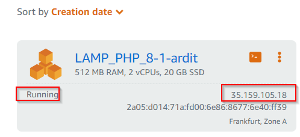

# Setting up an AWS Lightsail Instance with LAMP (PHP 8) Stack

This guide will walk you through setting up an Amazon Lightsail instance with a LAMP stack using PHP 8, and configuring it to deploy a PHP application from GitHub with database setup.

## Step 1: Create an Amazon Lightsail Account

If you haven't already, create an Amazon Lightsail account at [AWS Lightsail](https://lightsail.aws.amazon.com/ls/webapp/home/instances).

## Step 2: Create an Amazon Lightsail Instance

1. Click on **Create instance** in the Lightsail dashboard.
   

2. Choose your preferred Availability Zone (e.g., eu-west-1).
   

3. Select **Linux/Unix** platform and choose **LAMP (PHP 8)** as your blueprint.
   

4. Click on **+Add launch script** and paste the following script into the launch script text window.

```bash
# Remove default website
cd /opt/bitnami/apache2/htdocs 
rm -rf *

# Clone GitHub repo
git clone -b loft https://github.com/mikegcoleman/todo-php .

# Set write permissions on the settings file
sudo chown bitnami:daemon connectvalues.php
chmod 666 connectvalues.php

# Inject database password into configuration file
sed -i.bak "s/<password>/$(cat /home/bitnami/bitnami_application_password)/;" /opt/bitnami/apache2/htdocs/connectvalues.php

# Create database
cat /home/bitnami/htdocs/data/init.sql | /opt/bitnami/mariadb/bin/mysql -u root -p$(cat /home/bitnami/bitnami_application_password)

`\```

5. Click on **Enter a name** for your instance and choose **Create instance**


6. Wait for the instace to go into running state and access it via the **IP**


